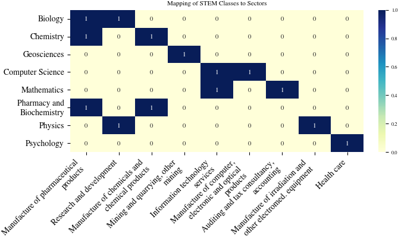

# Analysing Student Development

This project utilizes a Vector Autoregressive Model (VAR) to predict the number of students enrolled at the [University of Tübingen](https://uni-tuebingen.de) for specified courses, based on three different time-series datasets:
- [past enrolled students](https://uni-tuebingen.de/einrichtungen/verwaltung/iv-studierende/studierendenabteilung/statistiken/) at Eberhard Karls University Tuebingen
- [salary expectations](https://www-genesis.destatis.de/genesis//online?operation=table&code=62321-0001&bypass=true&levelindex=0&levelid=1702307320529#abreadcrumb) in certain sectors
- [high-school graduates in BW](https://www.statistik-bw.de/BildungKultur/SchulenAllgem/LRt0302.jsp)

## Get started
### Overview
The project uses the following structure.
```
.
├── dat
│   └── <Raw data>
├── doc
│   └── DataLiteracyStudentProject
│       ├── paper.pdf
│       └── paper.tex
├── exp
│   └── <Experiments notebooks>
├── src
│   └── <Small helper functions>
├── README.md
├── conda_env.yml
├── install_env.sh
└── run_notebooks.py
```

### Installation
To get started follow these steps:
#### 1. Install conda
This project uses [conda](https://conda.io/projects/conda/en/latest/index.html) as the package manager. Make sure you have Conda installed on your system.
You can verify that by running `conda -V` in your terminal. It should print your current version installed.
If the command fails, please install conda using this [guide](https://conda.io/projects/conda/en/latest/user-guide/install/index.html#regular-installation).


#### 2. Install environment
To set up the environment needed, run the `install_env.sh` script in your terminal. This process can take a while.
When the script finishes you should see this in your terminal.
```sh
./install_env.sh
```
```sh
...
done
#
# To activate this environment, use
#
#     $ conda activate data_literacy
#
# To deactivate an active environment, use
#
#     $ conda deactivate
```

#### 3. Activate the environment
All that's left is activating the environment.
```sh
conda activate data_literacy
```
That's it. You are all set now 🚀.

#### Notes
To deactivate the environment, use: `conda deactivate`.

If you want to delete the added conda environment from your system, you can run `conda remove -n data_literacy --all`.

`conda env list` lists all your environments. Note the `*` symbol next to the currently active env.

## Experiments
- Exp 1 - Regression: Build the VAR model
- Exp 2 - Analyses: Look into the properties of the computed model
- Exp 3 - Modifying data: What happens when there is a sudden change in salary expectations
- Exp 4 - Visualisation: Visualise computed parameters of the model
- Exp 5 - Mapping: Create a mapping from university courses to salary sectors
- Exp 6 - Optimizing Hyperparameters: Find the optimal configuration for the VAR model


## The Paper
This project uses GitHub-Actions to compile the latest `paper.tex` file into a PDF.

### Big versions
If the commit message contains `[PDF]` the PDF gets compiled and added to the Project in a new commit. Look out for a commit message `Update PDF`. If this is the latest commit, the PDF is up to date.
Otherwise read through the next section.

### Small increments
To see the PDF for the current commit navigate to the `Actions` tab. Select the `Create figures and create PDF` workflow. Click on the workflow run at the top, under `Artefacts` you can download the PDF.

### Figures
All figures that are used in the paper can be created by running the experiment notebooks in `exp/`. The generated PDFs are not part of the repository and have to be created. To do so you can run the notebooks individually, or you can execute the `run_notebooks.py` file to run them all at once.


## Mapping
A mapping has been used to be able to create a relationship between students enrolled in courses at university and salary expectations in a future career.
This is what we used:

